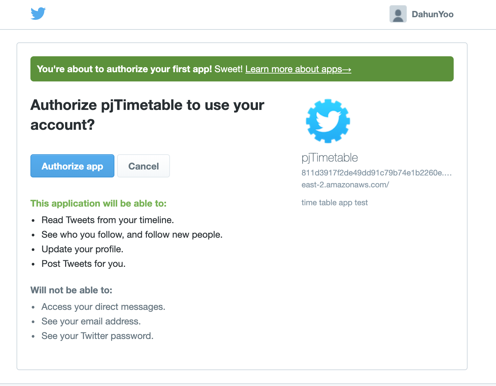

# Login with Twitter

### 概要
ツイッターIDを使って、ログインできるようにする。
めっちゃスムーズに行けました。
	- 関連gem
```ruby
#twitter連携用
gem 'omniauth'
gem 'omniauth-twitter'
```
twitterとの連動するためのgemです。APIの設定などはネットに資料が色々ありますので、省略します。
- - - -
### 各種設定

#### twitter_callback_controller
ローカル環境で、アドレスの後ろに`/auth/twitter`を入れて接続すると、認証画面が出ます。



ここで`Authorize app`を押したら、Callback処理が行われることになります。
帰ってきたデータを受け取る必要がありますね。

- - - -
うちの場合、`login_controller.rb`にその処理が書かれていましたが、こうなると最初ログイン画面に接続する場合、
返ってくるデータが何もないため、nilエラーが発生することになります。
なので、Callback処理だけを担当するcontrollerを作成しました。

- twitter_callback_controller.rb
```ruby
class TwitterCallbackController < ApplicationController
    def create
       # request.env['omniauth.auth']にユーザのTwitter認証情報が格納されている
    user_data = request.env['omniauth.auth']
    session[:nickname] = user_data[:info][:nickname]
    redirect_to main_page_show_path, notice: 'ログインしました' 
    end
end

```
`login_controller.rb`の内容と全く同じ内容です。しかし、`login_controller.rb` でcallback処理をしないように認め、nilエラーは発生しません。
ここで、処理がうまく行けば、`main_page_show_path`に遷移されます。メインページです。


#### routes.rb

`routes.rb` で必要な設定は、callbackで返ってきたデータをどのcontrollerで処理するかが必要です。

```ruby
get '/auth/:provider/callback', to: 'twitter_callback#create'
```
ここで`:provider`は自動的に`twitter`に変換されるようです。上記のアドレスからデータがくると、`twitter_callback_controller`の`create`に送って処理します。


#### show.html.erb

`twitter_callback_cotroller.rb`で、`session[:nickname]`に、ユーザーのnicknameを保持しています。
これを確認するために、メインページのカレンダーの上の部分に、ソースを追加しています。

```ruby
		<% if session[:nickname] %>
            <span><%= "#{session[:nickname]}さん、こんにちは" %></span>
     	<% end %>
```
sessionで、nicknameを持っていたら、出力するソースです。ここでnicknameとは、ツイッターのニックネームのことです。

これで、ツイッターをIDを使って、ログインする機能はできました。

#### login.html.erb

```html
<%= stylesheet_link_tag 'user', media: 'all', 'data-turbolinks-track' => true %>

    <div id="login">
      <form name='form-login'>
        <span class="fontawesome-user"></span>
          <input type="text" id="user" placeholder="Username">
       
        <span class="fontawesome-lock"></span>
          <input type="password" id"pass" placeholder="Password">
        
        <!--<input type="button" value="Login" id="ref">-->
        <%= link_to '<button type="button">Login</button>'.html_safe, main_page_show_path %>
        <%= link_to '<button type="button">Login in with Twitter</button>'.html_safe, '/auth/twitter' %>
      </form>
    </div>
```

ツイッター認証するボタンを追加しました。`/auth/twitter`に遷移し、ツイッターログインするようにしました。
デザインはこれからしなければなりません…

- - - -

上記の処理で、ツイッター認証する流れとしては、以下となります。

`Login in with Twitter`ボタン押下(/auth/twitterに遷移) -> ツイッター認証完了 -> `routes.rb`の設定より、`twitter_callback_cotroller`の`create`メソッドで処理 -> 問題なければ、メインページに遷移する。


参考資料
[Ruby on Rails: twitterでユーザー認証 - Qiita](https://qiita.com/keiya01/items/c96a0393c76f5560ee41)
[Ruby on RailsでTwitter認証機能を実装してみる - Reasonable Code](https://reasonable-code.com/rails-twitter-auth/)

